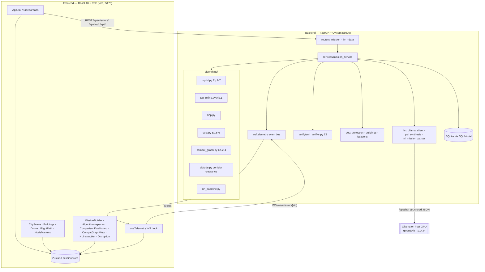
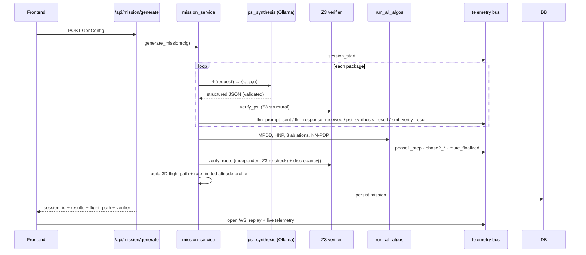

# Architecture

UAV-LLM is a two-service application: a **FastAPI** backend that runs the
research algorithms, the local LLM, and the Z3 verifier, and a **React + Three.js**
frontend that renders the mission in 3D and streams the "glass-box" telemetry.

## System diagram

## Request lifecycle (generate a mission)

## Key decisions

- **Ollama on the host, not in Docker.** Consumer GPU passthrough into containers
  is unreliable on Windows/WSL, so the backend container reaches the host model
  server at `host.docker.internal:11434`.
- **Deterministic missions.** A mission is fully determined by its `GenConfig`
  (seeded world generation), so persistence stores the config and a summary and
  rehydrates the full world after a restart by re-running generation.
- **Telemetry is decoupled.** Algorithm/LLM/verifier code emits via a
  context-scoped `emit()` that is a no-op when no session is active (e.g. in unit
  tests), so the math modules stay auditable against the papers.
- **Token-free 3D.** Building geometry is committed OSM GeoJSON extruded in plain
  Three.js — no Mapbox/Cesium key required; the app runs fully offline.
